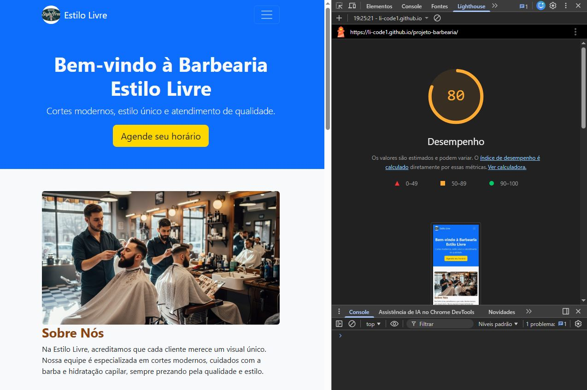
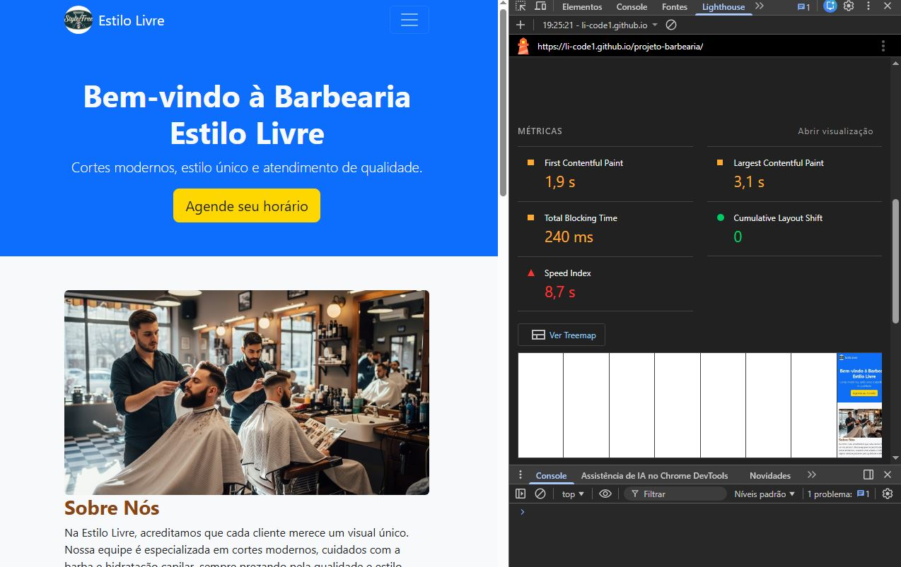
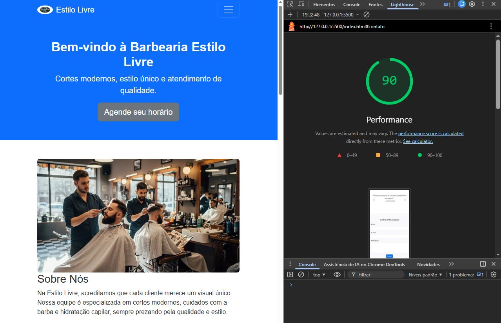
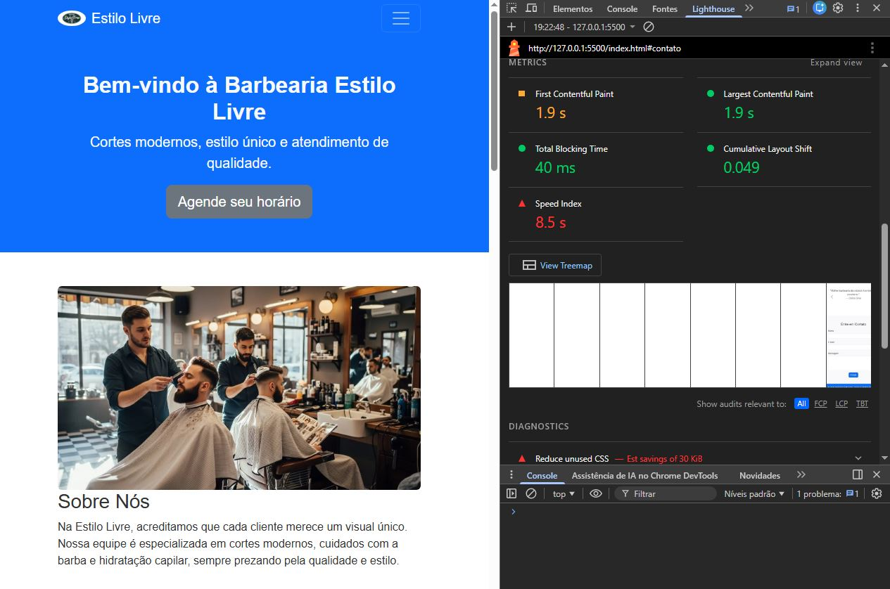

# 🪒 Projeto Barbearia - Estilo Livre (Otimização de Performance)

Este repositório contém o projeto de uma landing page para uma barbearia, desenvolvido originalmente com HTML5, CSS3 e Bootstrap 5. O projeto passou por um processo de auditoria e otimização de performance utilizando o **Chrome DevTools (Lighthouse)**.

## 📝 Descrição do Projeto

Uma página institucional simples, porém rica em elementos visuais (imagens de serviços e logo), o que gerava gargalos iniciais de carregamento e estabilidade visual.

---

## 🔍 Gargalos Identificados (Análise Inicial)

Na primeira análise, os principais problemas detectados foram:

1. **LCP (Largest Contentful Paint) elevado (3.1s):** Imagens pesadas demoravam para carregar a "dobra principal".
2. **TBT (Total Blocking Time) de 240ms:** O JavaScript do Bootstrap estava bloqueando a execução da página por muito tempo.
3. **Falta de formatos modernos:** Uso de imagens que poderiam ser otimizadas para WebP.

---

## 🛠️ Melhorias Aplicadas

Para resolver os problemas acima, foram aplicadas as seguintes técnicas:

* **Conversão de Imagens:** Todas as imagens foram convertidas para o formato `.webp`, reduzindo o peso total da página.
* **Atributos de Dimensão:** Adição de `width` e `height` em todas as tags `` para estabilizar o layout.
* **Lazy Loading:** Implementação do atributo `loading="lazy"` em imagens abaixo da dobra.
* **Otimização de Scripts:** Uso do atributo `defer` no script do Bootstrap, liberando a linha de execução principal (thread principal).
* **CSS de Estabilidade:** Aplicação de `aspect-ratio` no CSS para manter a proporção dos cards durante o carregamento.

---## 🖼️ Evidências dos Testes (Lighthouse)

Aqui estão as capturas de tela comparando o desempenho antes e depois das otimizações aplicadas.

### Relatório Inicial (Antes)

*Nota de performance: 80. LCP alto devido a imagens não otimizadas.*

### Relatório Final (Depois)

*Nota de performance: 90. Melhoria significativa no LCP e TBT após as correções.*

## 📊 Comparativo Antes vs. Depois (Dados Reais)

Os testes foram realizados em **Janela Anônima** para garantir que extensões não interferissem nos resultados.

| Métrica | Antes (Original) | Depois (Otimizado) | Resultado |
| --- | --- | --- | --- |
| **Performance Geral** | 80 | **90** | 🟢 **Subiu** |
| **LCP (Maior imagem)** | 3.1 s | **1.9 s** | ⚡ **-38%** |
| **TBT (Tempo de Bloqueio)** | 240 ms | **40 ms** | 🚀 **-83%** |
| **CLS (Estabilidade)** | 0 | **0.049** | ✅ **Estável** |
| **Speed Index** | 8.7 s | **8.5 s** | 📈 **Melhorou** |

### Conclusão da Análise:

A melhoria mais impactante foi no **TBT**, que caiu de 240ms para apenas 40ms, tornando a página muito mais responsiva ao clique do usuário quase instantaneamente. A redução do **LCP** para 1.9s coloca o site dentro dos padrões ideais recomendados pelo Google (abaixo de 2.5s).

---

## 📁 Estrutura de Entrega

* `/img`: Imagens otimizadas em WebP.
* `/css`: CSS com ajustes de performance.
* `index.html`: Código fonte com as tags de otimização.
* `relatorio-antes1.JPG` e `relatorio-depois1.JPG`: Prints dos testes Lighthouse.

